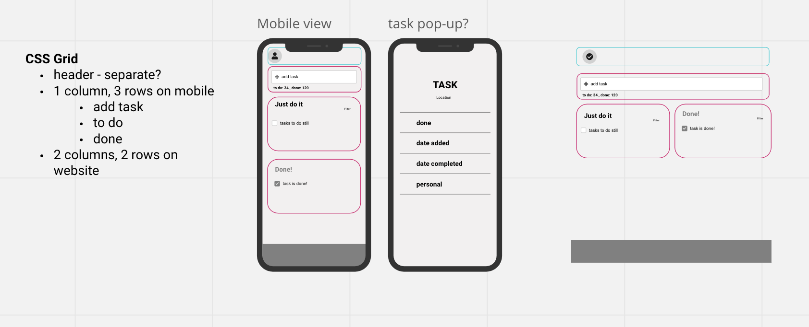

# JustDoIt

## AWS instructions

- Develop a static website: Create a basic static website using HTML, CSS, and JavaScript. You can use a static site generator like Jekyll or Hugo, or create the site from scratch.
- Set up version control: Create a Git repository to store your website code and manage version history. You can use a platform like GitHub, GitLab, or Bitbucket.
- Create an AWS account: Sign up for an AWS account if you haven't already. You will use AWS services to deploy and manage your website infrastructure.
- Install AWS CDK and set up the development environment: Follow the instructions provided in previous responses to install Node.js, AWS CLI, and set up the AWS CDK in your local project.
- Initialize your CDK project: Run the npx cdk init command to create a new CDK project in your preferred programming language. This will generate a boilerplate project structure and required dependencies.
- Define the application infrastructure: Use AWS CDK to define resources such as an Amazon S3 bucket for hosting your static website and an Amazon CloudFront distribution for caching content and providing HTTPS.
- Configure Amazon Route 53: If you have a custom domain, use Amazon Route 53 to create a hosted zone and configure the necessary DNS records. If you don't have a domain, you can skip this step and use the default domain provided by CloudFront.
- Deploy the infrastructure: Run the npx cdk deploy command to create the necessary resources in your AWS account. Take note of the S3 bucket name and CloudFront distribution domain name from the command output.
- Upload the website: Use the AWS CLI, AWS Management Console, or an S3 client to upload your static website files to the S3 bucket.
- Test your website: Visit the CloudFront distribution domain name (or your custom domain if you set up Route 53) in a web browser to verify that your website is live.

## About 
Our third project during the FAC skills bootcamp was to create a simple checklist/to do list. The goal of this project is to use our learnings on TDD (test driven development), advanced CSS and advanced DOM to create a dynamic way of sorting through a checklist. 
<br>
We started off by writing the tests first to help inform what functions to build and how to build them. So, before moving forward we wrote 4 tests, 2 each. 


## Project Brief & User Stories 

As a user I want to: 
- Add tasks to a list so that I can keep track of them
- Check things off my list so that I can see what I’ve done
- Delete things from the list if I don’t need to do them anymore
- Use all the features of the app without a mouse
- Filter out completed to-dos from my list so that I can focus on what’s left to do


## Learnings
### Testing 
- [ ] Check that passing a given input into our tests returns the expected output
- [ ] Write tests to mimic the behaviour of a user performing different actions

We used TDD but then when refactoring the code, we didn't go back to rewrite the tets.

### JS 
- [x] Write testable, modular functions
- [x] Write functions that add, remove or modify DOM nodes
- [x] Apply event listeners to HTML form elements
- [x] Use scope to control what variables are accessible inside functions and blocks

### Design 
- [x] Use CSS grid to create complex layouts
- [x] Use CSS grid to make layouts that adapt to the viewport size

## Accessing the project

You can clone into JustDoIt in your text editor with the below terminal prompt:

```
git clone https://github.com/fac27/JustDoIt
```

From there, you can access and open the index.html file within your browser.

We removed the promises as they were redundant but haven't merged yet - they're in the branch remove-promises.
